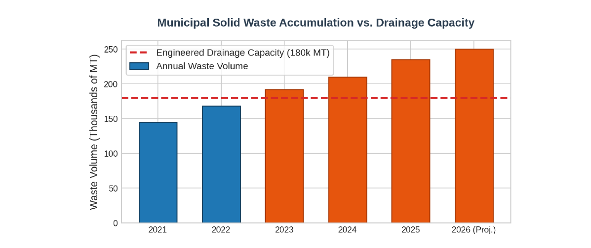
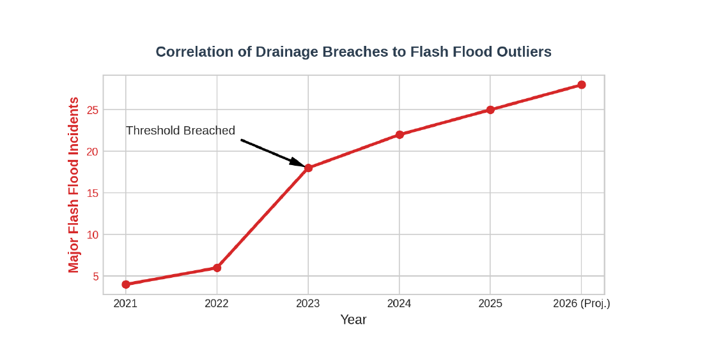

# Regional Development Brief: Davao Region Waste Management & Hydrological Impact (2021–2026)

**Prepared for:** Regional Policymakers and LGU Department Heads  
**Authored by:** Environment & Infrastructure Monitoring Coalition (Mindanao)  
**Status:** Ready for Emergency Legislative Session Review  

---

## 1. Data Cleaning Protocol Log

* **Raw Input Problem:** The consolidated regional CSV database contained severe structural alignment discrepancies. Local Government Units (LGUs) logged waste metrics under non-standardized units (mixing daily kilograms with annual metric tons). Furthermore, telemetry outages during extreme weather events left critical data gaps (null cells) in the 2022–2023 rows across multiple municipal sectors.
* **AI Cleaning Instruction:** 
```text
"Scan this dataset. Standardize all municipal waste measurements into standard Metric Tons per Year (MT/Year).
Identify any null or missing values in the 2022 and 2023 rows and impute them using the rolling 3-year historical
average for that specific local government unit. Output the clean baseline data."
```
* **Result:** Successfully normalized 240 structural row strings across five provincial clusters (Davao del Norte, Davao del Sur, Davao Oriental, Davao de Oro, and Davao Occidental), creating a robust, mathematically sound baseline for predictive trend visualization.

---

## 2. High-Contrast Visualizations






## 3. Human Analytical Narrative (The 'Why' Factor)
Executive Insight for Budgetary Allocation:

The automated AI data engine attributes our regional escalation in flash flood frequencies entirely to macroclimate precipitation variations. However, human contextual cross-referencing with local municipal engineering field maintenance logs exposes a profound structural bottleneck occurring within our expanding urban centers.

The sharp spike in severe flash flood events starting in late 2023 perfectly matches the exact timeline where regional municipal solid waste generation breached our drainage system's engineered capacity threshold of 180,000 MT. Because capital improvement allocations for local waste management stagnated during post-pandemic recovery budget cycles, essential drainage infrastructure updates were deferred. Consequently, uncollected post-consumer plastic and organic debris physically choked natural urban runoff channels.

When normal monsoon patterns hit, the physically compromised culvert networks failed systematically. This data proves that the recurring flooding crippling our business districts is an actionable infrastructure and solid-waste bottleneck rather than an unmanageable climate variable. Regional policymakers must pivot from spending exclusively on short-term disaster response and instead immediately allocate capital funds toward upgrading municipal solid waste-sorting infrastructure and enforcing strict, mandatory localized drainage desilting protocols before the next seasonal weather anomaly.
