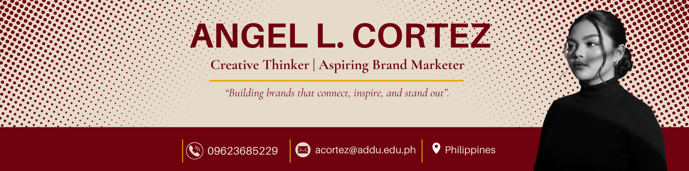
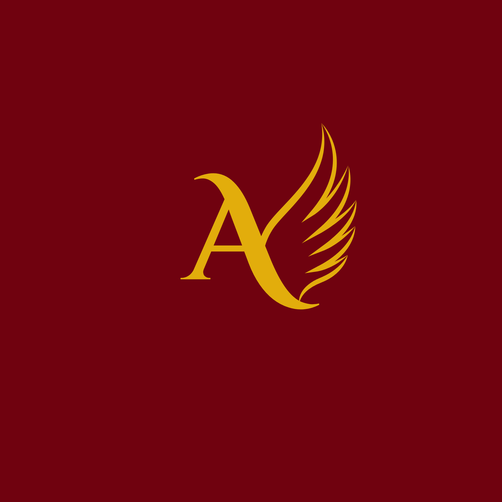
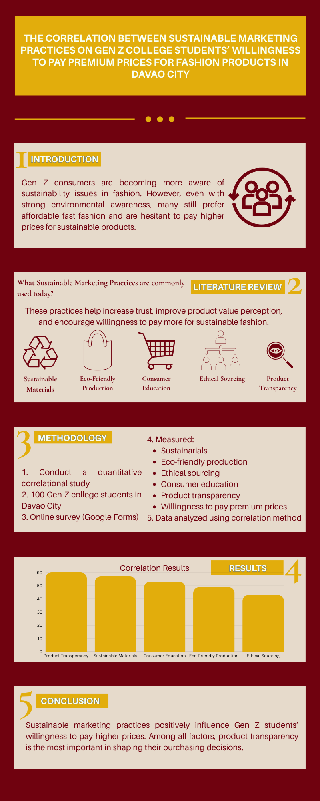

# GE-IT-Skills-portfolio
##  Professional Bio
Hello everyone! I am Angel L. Cortez, an aspiring Brand Marketer and creative thinker with a passion for visual communication, branding, and design. I enjoy creating meaningful visuals that express ideas clearly, build strong brand identities, and connect with audiences through creativity and innovation.

> **"Building brands that connect, inspire, and stand out."** 

---

## Project Showcase

### Project 1: BRANDING
<!-- Requirement 2: Embedded image using a relative file path -->
  

[Visit my Personal Portfolio Link]( https://canva.link/glpkjr15aqqofzi)

####  Design Reflection
<!-- Requirement 3: 2-3 sentence reflection -->

This project was designed to establish my personal brand by combining creativity, confidence, and professionalism. I used a bold yet elegant color palette, clean typography, and organized layouts to create a strong visual identity that represents my personality, skills, and aspirations in branding and marketing.

---

### Project 2: VISUALS

####  Design Reflection
This project was designed using a structured layout, creative icons, and a consistent color scheme to effectively showcase my skills in art and design. The combination of digital and traditional art elements highlights my creativity while maintaining a clean, professional, and visually engaging presentation.

---

### Project 3: DOCS

####  Design Reflection
This project was designed using a clear section-by-section layout, visual hierarchy, and relevant icons to present research findings in an organized and easy-to-understand format. The consistent color palette and structured flow help simplify complex information while maintaining a professional and visually appealing design. 

---

### Project 4: MEDIA
<!-- Requirement 2: Embedded image using a relative file path -->
[Visit my Prototype Link](https://canva.link/4qi8v5v6w20oahb )

[Visit my Personal Introduction Video Link]( https://canva.link/dspc34y26whb1pa)

####  Design Reflection
For this project, I developed a prototype for Aurengel Perfume, featuring a signature collection, product information, and contact details, organized in a clean, user-friendly layout. I used the color palette Deep Burgundy, Royal Gold, and Warm Ivory to create a bold, elegant, and luxurious brand identity while maintaining visual consistency throughout the design. I also created a personal introduction video in a minimalist style, with smooth transitions, to present information clearly and professionally. 

